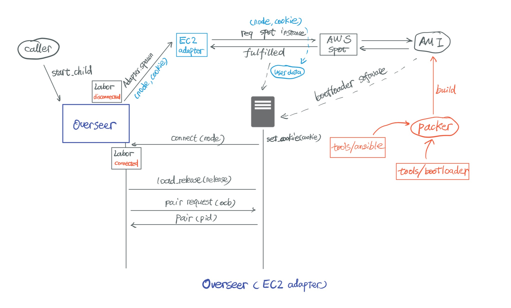

# Overseer

Overseer is a OTP behavior that mimics the behavior of Supervisor, however instead of managing a list of processes, Overseer manages a list of dynamic nodes. It aims to eliminate the complexity of:

* creating nodes for distributed computing by various solutions (e.g. EC2 spot instance)
* control how node process the computation workload (dynamically load a predefined release to target nodes)
* receive and process the telemetry
* manage the node state machine (up / down)

__Warning: this software is in very early stage. It's unstable and will be changed drastically in near future. Feel free to play with it but please do not use it in production. Issues / Suggestions are welcome!__

## Concepts

* slave node: node that created by the overseer for computation purpose.
* pairing: when a slave node is up and running, overseer will send a RPC request to a predefined endpoint (designated in the ) to initiate the pairing process. By pairing, both overseer and slave node know the pid for each other so the bidirectional communication is much easier (e.g. sending telemetry)
* bootloader: a minimum software to boot a slave node. If you want to use EC2 spot adapter, you must use the ami which is generated by the bootloader under ``tools``. Note that you can build your own bootloader.

## Usage and how it works

User can create their own overseer server like this:

```elixir
defmodule MyOverseer do
  use Overseer
  require Logger

  # How do we want to start the node
  @ec2_adapter {Overseer.Adapters.EC2,
                %{
                  region: "us-west-1",
                  zone: "us-west-1c",
                  key_name: "Your AWS key",
                  price: 0.15,
                  image: "ami-xxxxxxxx",
                  instance_type: "c5.large",
                  iam_role: "arn:aws:iam::xxxxxxxxxx:instance-profile/xxx",
                  subnet: "subnet-xxxxxxxx",
                  security_groups: ["sg-xxxxxxxx", "sg-xxxxxxxx"],
                }}

  # where to load the release and how pairing is initiated
  @release {:release, "https://abc.com/dataplane.tar.gz", {Bootloader.Initd, :pair}}

  # strategy and limitations (now we only support simple_one_for_one)
  @opts [
    strategy: :simple_one_for_one,
    max_nodes: 10
  ]

  def start_link do
    spec = {@ec2_adapter, @release, @opts}
    Overseer.start_link(__MODULE__, spec, name: __MODULE__)
  end

  def call(:state) do
    GenServer.call(__MODULE__, :state)
  end

  def debug do
    GenServer.call(__MODULE__, :"$debug")
  end

  def init(_) do
    {:ok, %{}}
  end

  def handle_call(:state, _from, state), do: {:reply, state, state}

  def handle_connected(node, state) do
    Logger.info("node #{node} up: state #{inspect(state)}")
    {:ok, state}
  end

  def handle_disconnected(node, state) do
    Logger.info("node #{node} down: state #{inspect(state)}")
    {:ok, state}
  end

  def handle_telemetry(data, state) do
    Logger.info("node #{data.name}: telemetry data: #{inspect(data)}")
    {:ok, state}
  end

  def handle_terminated(_node, state) do
    {:ok, state}
  end

  def handle_event(_event, _node, state) do
    {:ok, state}
  end
end

# in a different context, one can
# start the overseer
MyOverseer.start_link()

# start a single child
MyOverseer.start_child()
```

Once ``start_child`` is executed, a bunch of work happened underlying (take EC2 adapter as an example):

1. Overseer calls ``Adapter.spawn()``.
2. EC2 adapter will then request a spot instance with designated AMI, which contains a very simple bootloader.
3. The cookie and the node name of Overseer are written into user data when the instance is brought up.
4. Once instance is up, systemd will start bootloader, and bootloader will load the cookie / node name from user data of the instance, and then connect with the node of Overseer.
5. Overseer got notified for the ``node_up`` event, it will then load the release into newly brought up slave node. For more information about how to load a module / release to remote node, see [ex_loader](https://github.com/tubitv/ex_loader). Then a pair handshake is started between Overseer and slave node.
6. Slave node will then get a pair message with Overseer's pid, it will send pair message back to the pid with its own pid.
7. Overseer will then be in a paired state for that slave node.
8. Depending on what logic is contained in the release, slave node will start its job and send telemetry back to Overseer.
9. Once everything is finished, slave node can notify Overseer so that Overseer can decide if it shall terminate the slave node.



### Build your own bootloader

See [README.md in tools directory](tools/README.md)


## Installation

``overseer`` is available in [hex](https://hex.pm/packages/overseer), it can be installed
by adding `overseer` to your list of dependencies in `mix.exs`:

```elixir
def deps do
  [{:overseer, "~> 0.1.0"}]
end
```

Full documentation can be found at [https://hexdocs.pm/overseer](https://hexdocs.pm/overseer).
